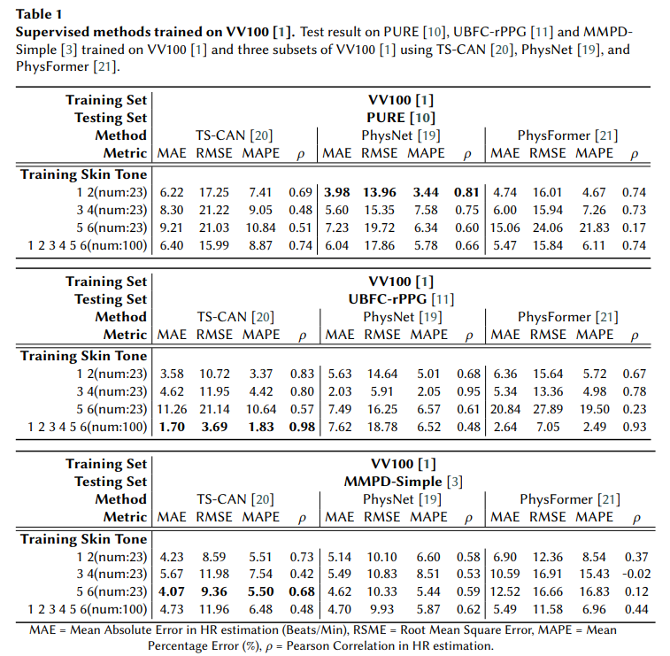
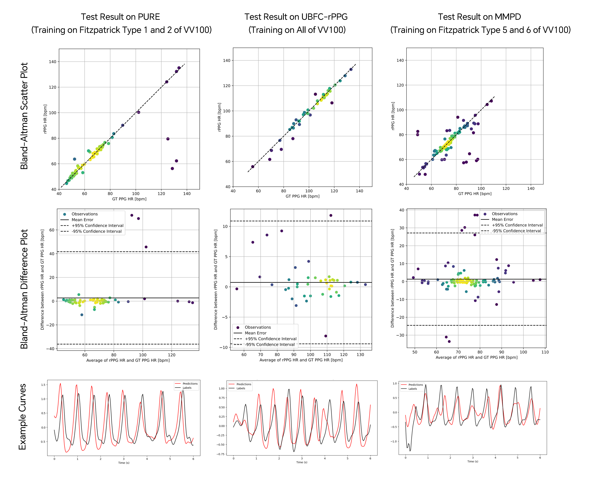
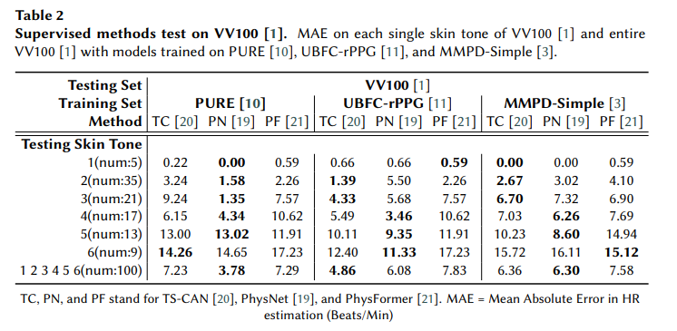

:heart: Please remember to :star: this repo if you find it useful and cite our work if you end up using it in your work! :heart:

:heart: If you have any questions or concerns, please create an <a href="https://github.com/ubicomplab/rPPG-Toolbox/issues">issue</a> :memo:! :heart:

# :file_folder: Datasets
The toolbox supports six datasets, namely SCAMPS, UBFC-rPPG, PURE, BP4D+, UBFC-Phys, and MMPD. Please cite the corresponding papers when using these datasets. For now, we recommend training with UBFC-rPPG, PURE, or SCAMPS due to the level of synchronization and volume of the datasets. **To use these datasets in a deep learning model, you should organize the files as follows.**
* [MMPD](https://github.com/McJackTang/MMPD_rPPG_dataset)
    * Jiankai Tang, Kequan Chen, Yuntao Wang, Yuanchun Shi, Shwetak Patel, Daniel McDuff, Xin Liu, "MMPD: Multi-Domain Mobile Video Physiology Dataset", IEEE EMBC, 2023
    -----------------
         data/MMPD/
         |   |-- subject1/
         |       |-- p1_0.mat
         |       |-- p1_1.mat
         |       |...
         |       |-- p1_19.mat
         |   |-- subject2/
         |       |-- p2_0.mat
         |       |-- p2_1.mat
         |       |...
         |...
         |   |-- subjectn/
         |       |-- pn_0.mat
         |       |-- pn_1.mat
         |       |...
    -----------------

* [UBFC-rPPG](https://sites.google.com/view/ybenezeth/ubfcrppg)
    * S. Bobbia, R. Macwan, Y. Benezeth, A. Mansouri, J. Dubois, "Unsupervised skin tissue segmentation for remote photoplethysmography", Pattern Recognition Letters, 2017.
    -----------------
         data/UBFC-rPPG/
         |   |-- subject1/
         |       |-- vid.avi
         |       |-- ground_truth.txt
         |   |-- subject2/
         |       |-- vid.avi
         |       |-- ground_truth.txt
         |...
         |   |-- subjectn/
         |       |-- vid.avi
         |       |-- ground_truth.txt
    -----------------

* [PURE](https://www.tu-ilmenau.de/universitaet/fakultaeten/fakultaet-informatik-und-automatisierung/profil/institute-und-fachgebiete/institut-fuer-technische-informatik-und-ingenieurinformatik/fachgebiet-neuroinformatik-und-kognitive-robotik/data-sets-code/pulse-rate-detection-dataset-pure)
    * Stricker, R., Müller, S., Gross, H.-M.Non-contact "Video-based Pulse Rate Measurement on a Mobile Service Robot"
in: Proc. 23st IEEE Int. Symposium on Robot and Human Interactive Communication (Ro-Man 2014), Edinburgh, Scotland, UK, pp. 1056 - 1062, IEEE 2014
    -----------------
         data/PURE/
         |   |-- 01-01/
         |      |-- 01-01/
         |      |-- 01-01.json
         |   |-- 01-02/
         |      |-- 01-02/
         |      |-- 01-02.json
         |...
         |   |-- ii-jj/
         |      |-- ii-jj/
         |      |-- ii-jj.json
    -----------------

* [VitalVideo]
    * Toye P J. Vital Videos: A dataset of videos with PPG and blood pressure ground truths[J]. arXiv preprint arXiv:2306.11891, 2023.
    -----------------
         data/VitalVideo/
         |   |-- vv100/
         |      |-- 0a687dbdecde4cf1b25e00e5f513a323_1.mp4
         |      |-- 0a687dbdecde4cf1b25e00e5f513a323_2.mp4  
         |      |-- 0a687dbdecde4cf1b25e00e5f513a323.json
         |      |...
         |   |-- vv250/
         |      |-- 0a687dbdecde4cf1b25e00e5f513a323_1.mp4
         |      |-- 0a687dbdecde4cf1b25e00e5f513a323_2.mp4  
         |      |-- 0a687dbdecde4cf1b25e00e5f513a323.json
         |      |...
         |   |--vvAllCompressed/
         |      |-- 0a687dbdecde4cf1b25e00e5f513a323_1.mp4
         |      |-- 0a687dbdecde4cf1b25e00e5f513a323_2.mp4  
         |      |-- 0a687dbdecde4cf1b25e00e5f513a323.json
         |      |...
    -----------------

# :bar_chart: Benchmarks

We have done experiments across vv100 and other three datasets - PURE, UBFC-rPPG, MMPD.

## Unsupervised Methods on vv100 and vvAll

The figure shows Mean Absolute Error (MAE) performance on each single skin tone of vv100 and vvAll with six unsupervised methods. Colors of lines get darker along with the variation of the skin tone.

## Training on vv100 and test on PURE, UBFC-rPPG, MMPD

The table shows Mean Absolute Error (MAE) performance training on vv100 and testing on other three datasets:

The figure shows three important results of the experiment. Bland-Altman plots can be found in folder `/run/exp/` and test samples are provided from a python notebook for visualizing test-set neural method output predictions and labels can be found in `tools/output_signal_viz`.

## Training on PURE, UBFC-rPPG, MMPD and test on vv100

The table shows Mean Absolute Error (MAE) performance training on other three datasets and testing on vv100:

# :wrench: Setup

Create a conda environment with the configuration file:

`conda env create -f environment.yml`

# :computer: Examples of Neural Network Training

Please use config which has *train_and_test* in *TOOLBOX_MODE*.

Training on VitalVideo and Testing on MMPD With TSCAN.

STEP 1: Download the VitalVideo and MMPD raw data.

STEP 2: Create a HDF5 file of ppg data list from VitalVideo with running `python set_list.py`

STEP 3: Modify `./configs/vv100_train_configs/vv100_vv100_MMPD_TSCAN_BASIC.yaml`

STEP 4: Run `python main.py --config_file ./configs/vv100_train_configs/vv100_vv100_MMPD_TSCAN_BASIC.yaml`

Note 1: Set *DO PREPROCESS* to *True* on the yaml file if it is the first time. And turn it off when you train the network after the first time.

Note 2: The example yaml setting will allow 100% of VitalVideo to train and 100% of MMPD to test. 
After training, it will use the last model to test on MMPD.

# :computer: Example of Using Pre-trained Models

Please use config which has *only_test* in *TOOLBOX_MODE*.

For example, if you want to run The model trained on VitalVideo and tested on PURE.

STEP 1: Modify `./configs/vv100_test_configs/vv100_PURE_TSCAN_BASIC.yaml`

STEP 2: Run `python main.py --config_file ./configs/vv100_test_configs/vv100_PURE_TSCAN_BASIC.yaml`
